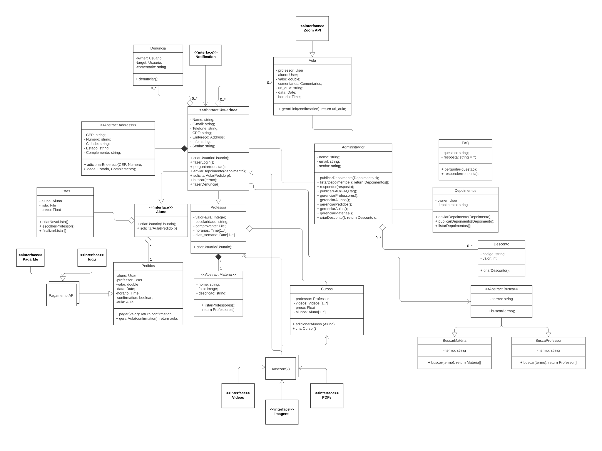

# Diagrama de Classe

O diagrama de classes foi pensado em conjunto com o time. De forma que todos puderam das a percepção sobre o Diagrama de Classes, e nele foi definido em nível lógico todos os relacionamentos dentro do software.

