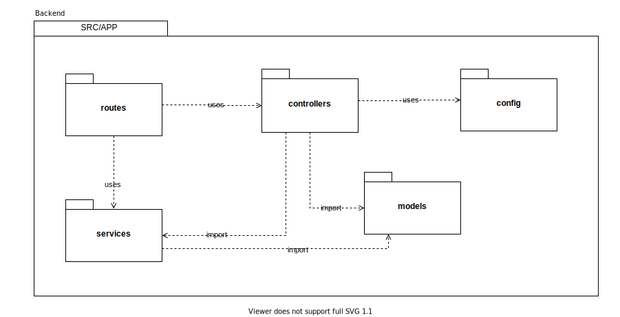
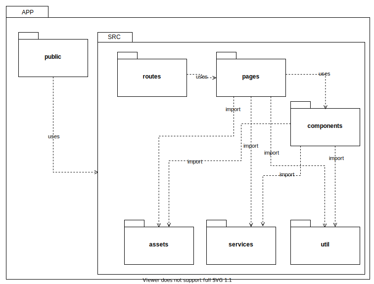

# Diagrama de Pacotes

O diagrama de pacotes estrutural do projeto está disposto da seguinte forma.

## Backend

* Routes: "Porta de entrada" da API.
* Controller: Estrutura toda a regra de negócio da aplicação.
* Config: Define variáveis de ambiente.
* Models: Define as estruturas que são salvas no Banco de Dados
* Services: Define a implementações de API externas ao servidor.

## Frontend

* Public: Armazena a raiz do projeto.
* Routes: Define o sistema de rotas do projeto
* Pages: Armazena todas as paginas do projeto.
* Components: Armazena todos os componentes do projeto.
* Assets: Armazena arquivos estáticos, como imagens e icones.
* Services: Implementa a conexão do Cliente com o Servidor.
* Util: Implementa funções que são amplamente utilizadas.